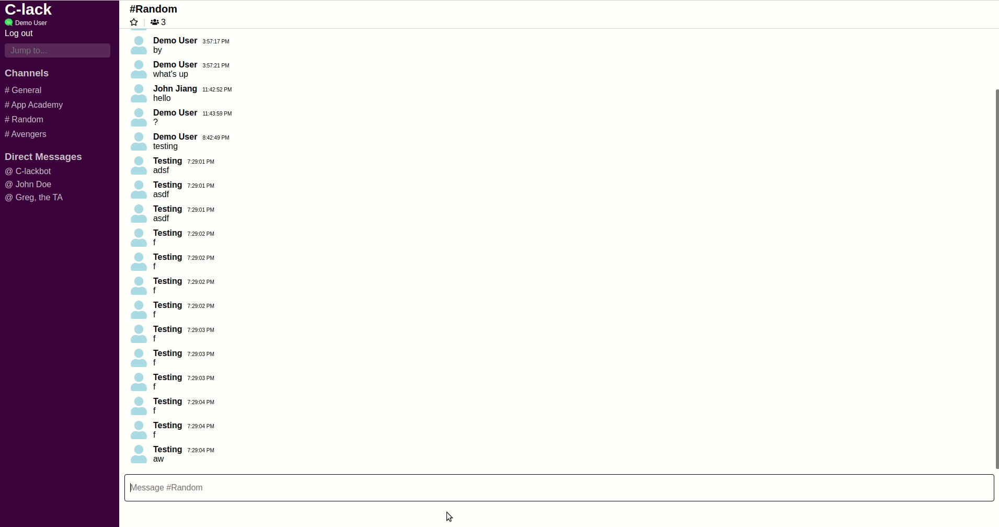
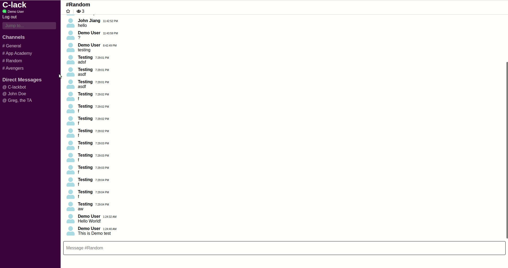

## C-Lack
C-lack is a clone based of off Slack.com. It is essentially a chat room, designed to replace email.
<a href="https://c-lack.herokuapp.com">Live Site</a> 

### Impelmented Technologies:

- HTML
- CSS
- SASS
- JavaScript
- Postgres
- Ruby on Rails
- Webpack
- React
- Redux

### Overview:

### Live Chat:

### Channels:

User is able to join/leave different channels and view the messages within that channel

Schema Diagram

    

Schema diagram : https://dbdiagram.io/d/5e46ed4f9e76504e0ef1772a

Credits:
    
- Icons in chat - react-icons.netlify.com   
- Icons - flaticon.com
- Slack rolling balls video - slack.com
- Slack CEO video - youtube.com
    
